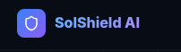
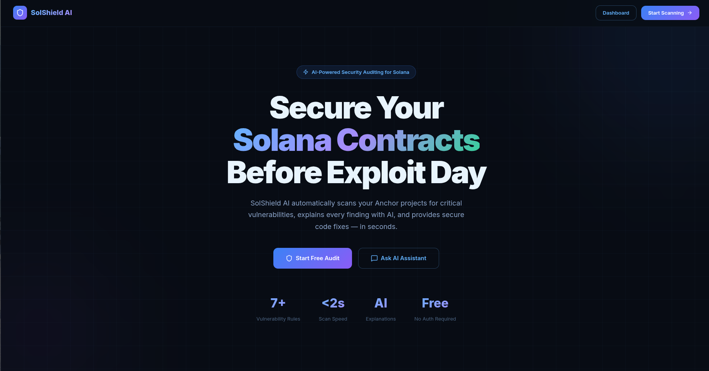

<p align="center">
  
</p>

<h1 align="center">SolShield AI</h1>
<p align="center">
  <strong>AI-Powered Solana Smart Contract Security Copilot</strong>
</p>

<p align="center">
  
  
  
  
</p>

---

## 🛡️ Overview

**SolShield AI** is a comprehensive, AI-driven security auditing platform specifically designed for the Solana ecosystem. It empowers developers to detect, understand, and remediate vulnerabilities in Anchor and Rust smart contracts *before* they hit the mainnet.

By combining deep AST (Abstract Syntax Tree) analysis with state-of-the-art AI models, SolShield AI provides more than just a list of bugs—it offers actionable insights, exploit scenarios, and secure remediation steps in plain English.



## ✨ Key Features

-   **🔍 Multi-Source Scanning**: Upload local Anchor/Rust projects or scan entire GitHub repositories directly.
-   **🤖 AI-Powered Explanations**: Every vulnerability is accompanied by an AI-generated breakdown of why it's dangerous and how to fix it.
-   **💻 Interactive Code Viewer**: A Monaco-based editor that highlights vulnerable lines in real-time, providing context exactly where it's needed.
-   **📊 Security Scoring**: Get a high-level overview of your project's health with automated severity scoring.
-   **🚀 Real-Time Visualization**: Track the progress of your security scans with a dynamic, interactive dashboard.
-   **🛠️ Solana-Specific Detection**:
    -   Missing Signer Validations
    -   Unsafe Account Handling
    -   PDA (Program Derived Address) Misuse
    -   Insecure CPI (Cross-Program Invocation) Patterns
    -   Unsafe Rust Operations

## 🚀 Why SolShield AI?

In the fast-moving Solana ecosystem, even a small validation error can lead to millions in lost funds. Traditional professional audits are often:
-   **Expensive**: Prohibitive for indie developers and hackathon teams.
-   **Slow**: Taking weeks or months to complete.
-   **Opaque**: Providing reports that are hard for junior developers to interpret.

SolShield AI acts as your **24/7 Security Copilot**, bridging the gap between development speed and blockchain security.

## 🛠️ Tech Stack

-   **Frontend**: Next.js 15, TailwindCSS, Monaco Editor, Framer Motion.
-   **Backend**: FastAPI (Python), Tree-sitter (for Rust AST parsing), Gemini AI / OpenAI APIs.
-   **Database/Auth**: PostgreSQL, Firebase Authentication.
-   **DevOps**: Docker, Docker Compose.

## 🏁 Getting Started

### Prerequisites

-   Docker and Docker Compose
-   A Gemini API Key (or supported AI provider)
-   Firebase Service Account credentials

### Installation & Setup

1.  **Clone the repository**:
    ```bash
    git clone https://github.com/your-username/SolanaSecurityCopilot.git
    cd SolanaSecurityCopilot
    ```

2.  **Configure Environment Variables**:
    Create a `.env` file in the root directory (referencing `.env.example`):
    ```env
    GEMINI_API_KEY=your_api_key_here
    DATABASE_URL=postgresql://user:password@db:5432/solshield
    NEXT_PUBLIC_API_URL=http://localhost:8000
    ```

3.  **Launch with Docker**:
    ```bash
    docker-compose up --build
    ```

4.  **Access the application**:
    -   Frontend: `http://localhost:3000`
    -   Backend API: `http://localhost:8000/docs`

## 🔮 Future Scope

-   **[ ]** Automated exploit simulation and fuzzing.
-   **[ ]** CI/CD integration for GitHub Actions.
-   **[ ]** VSCode Extension for real-time IDE security feedback.
-   **[ ]** On-chain audit certificates and trust scores.

## 🤝 Contributing

We welcome contributions from the community! Whether you're a security researcher or a frontend wizard, feel free to open an issue or submit a pull request.

## 📜 License

This project is licensed under the MIT License - see the [LICENSE](LICENSE) file for details.

---

<p align="center"> Built with ❤️ for the Solana Ecosystem </p>
